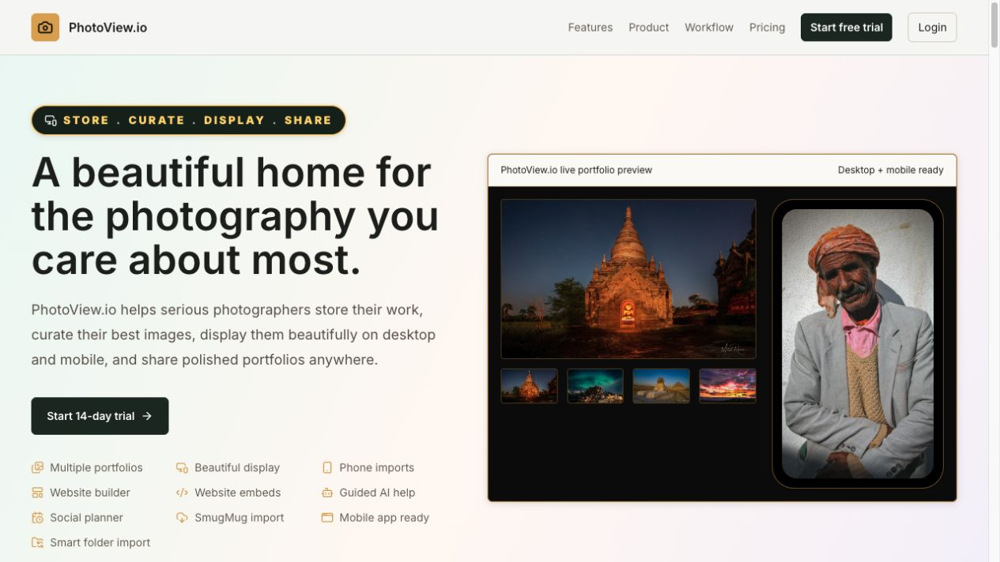
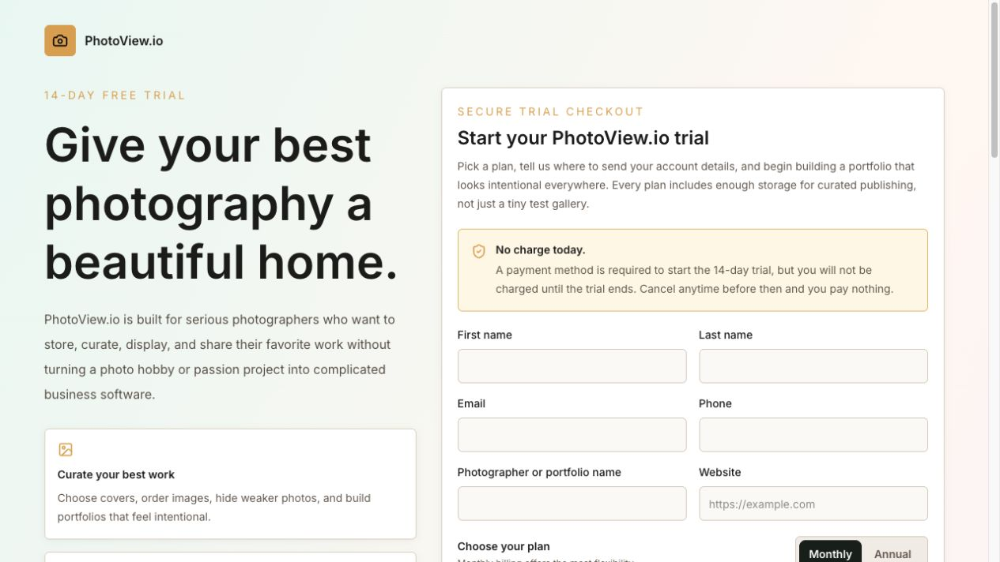
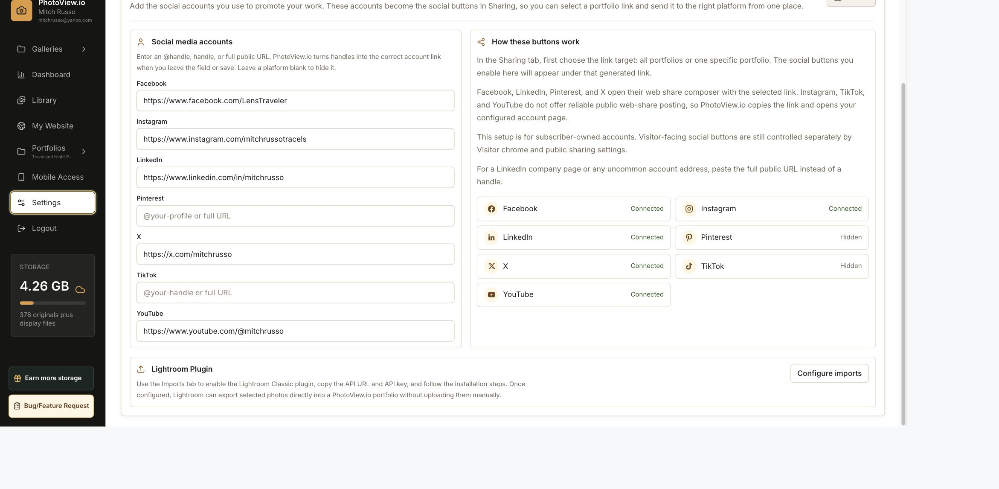
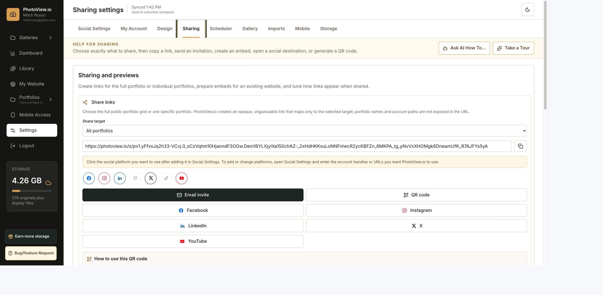
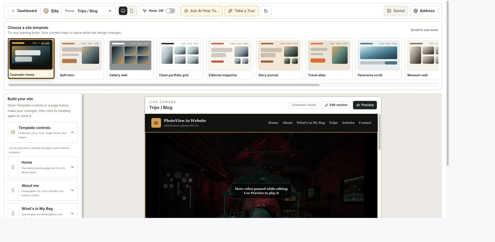
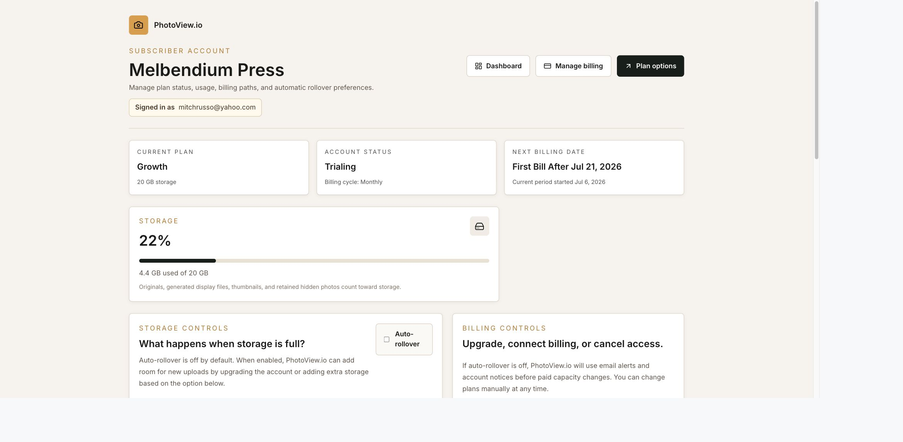

# PhotoView.io Beta QA and Code Review — July 19, 2026

## Overall health

**Strong, with the issues found in this pass corrected.** The core beta journeys work: marketing, registration, subscriber identity, portfolio management, sharing, campaign scheduling, imports, website building, account management, and protected admin access. The production error review found no unresolved current delivery failure; recent lifecycle email deliveries are succeeding.

## Method

1. Established a clean baseline and ran the complete automated regression suite.
2. Walked the public home and registration paths in the in-app browser.
3. Walked the authenticated dashboard, Social Settings, Sharing, Scheduler, Imports, website builder, and Account paths in the signed-in Chrome session.
4. Exercised secure-link copy feedback and refreshed a deliberately stale dashboard tab.
5. Compared visible language against the required Gallery → Portfolio → Photo hierarchy.
6. Reviewed server routes involved in portfolio persistence, website publication state, QR creation, uploads, authentication, and lifecycle email delivery.
7. Inspected Vercel production runtime error clusters and the current email-delivery records.
8. Ran tests, lint, TypeScript, dependency audit, and the optimized production build.

## Evidence

### 1. Public homepage — healthy

The value proposition, primary trial action, feature list, and product preview are visible without ambiguity.

### 2. Trial registration — healthy

The no-charge-today message, identity fields, plan selection, and trial terms are presented clearly.

### 3. Social Settings — issue found and fixed

Opening Settings inherited the prior page's scroll position, hiding the page title, tabs, and help. Settings and primary panel changes now return to the top.

### 4. Sharing — healthy, with privacy hardening added

Opaque share links are used, the Copy control confirms success, and the intended target is explicit. QR images are now created by PhotoView.io instead of sending secure URLs to an outside QR provider.

### 5. Website builder — issues found and fixed

The selected Trips / Blog focus could restore before the canvas existed, leaving the live canvas on Home. The focus effect now reruns when the website panel mounts. The toolbar also distinguishes **Draft—not live** from **Published** so a reserved address is not mistaken for a live site.

### 6. Subscriber account — healthy

The workspace name, signed-in email, plan, status, billing date, and storage usage are all visible and understandable.

## Corrections made

1. Prevented the dashboard from sending an unnecessary portfolio save immediately after load.
2. Added a direct **Refresh latest data** recovery action when an older tab conflicts with newer server data.
3. Reset page position when switching major dashboard panels, Settings tabs, or active portfolios.
4. Restored the correct website canvas section when reopening the builder.
5. Added an explicit **Draft—not live** / **Published** status to the website builder.
6. Renamed the Settings tab and controls from ambiguous “Gallery” wording to **Portfolio**, while preserving Galleries as the parent organizational level.
7. Renamed desktop import **Gallery name** to **Portfolio name** and SmugMug **Import galleries** to **Import portfolios**.
8. Updated AI Help text to match the corrected terminology.
9. Replaced the third-party QR generator with a private internal SVG route restricted to PhotoView.io targets.
10. Added regression tests covering all of the changes above.

## Verification

- Regression tests: **126 passed, 0 failed**
- ESLint: **passed**
- TypeScript: **passed**
- Production build: **passed; 82 routes generated/validated**
- Production dependency audit: **0 vulnerabilities**
- Runtime review: old Resend 422 entries were transient; current automation delivery records show successful sends, including July 19 deliveries

## Remaining beta watch items

These are operational observations, not release blockers:

1. Watch the first real beta imports from Lightroom, desktop folders, and SmugMug for source-specific file edge cases.
2. Watch social OAuth approvals and real scheduled delivery once provider applications are enabled.
3. Watch first external trial conversions and cancellation webhooks in Stripe.
4. The `mitchrusso.photoview.io` address correctly remains unavailable until that draft website is explicitly published.
