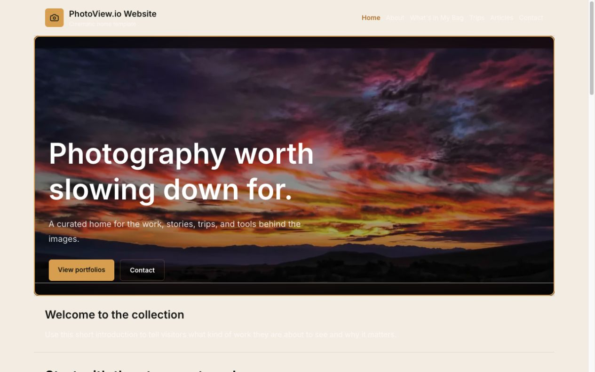
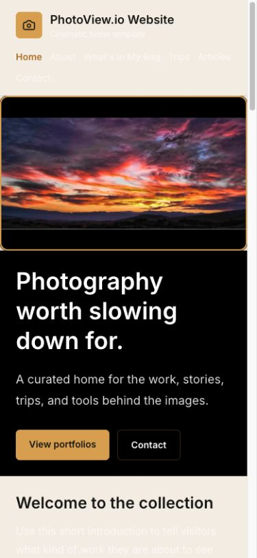
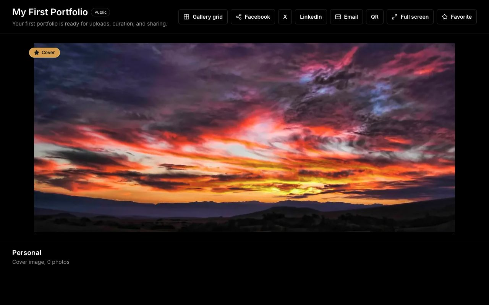

# PhotoView.io launch-readiness audit

Date: July 16, 2026  
Scope: repository quality, production configuration, security controls, subscriber journeys, public websites, responsive behavior, operations, and launch readiness.

## Verdict

PhotoView.io is suitable for a supervised private beta, but it is not yet ready for an unrestricted public invitation campaign. The automated foundation is strong; the remaining blockers are concentrated in customer-facing behavior that could publish an unreadable or incomplete site, accept a video in the wrong product area, or send a visitor to the wrong portfolio destination.

## Remediation completed after the audit

The launch-blocking product findings were corrected immediately after this evidence was captured:

- ordinary portfolio uploads now accept still images only, with matching client and server validation plus rate limiting;
- Hero MP4 remains available only through the dedicated 200 MB / 90-second Hero Video workflow;
- published navigation and muted copy now inherit the subscriber's selected text color instead of template-specific white text;
- publishing now blocks visible starter copy and requires a valid contact delivery email when Contact is enabled;
- previously published sites with no contact email no longer expose a dead Contact page, form, or contact links;
- public portfolio counts now use consistent singular/plural wording and include the cover in the total;
- Gallery grid now returns visitors to the subscriber's own published website;
- unscoped legacy gallery lookups no longer depend on one global workspace slug;
- AI help and the publishing Tour now explain the readiness requirements.

The historical screenshots and findings below are intentionally retained as the before-fix audit evidence. SuperAdmin MFA/reauthentication, external exception/performance monitoring, exact 1280×800 hardware validation, and the large dashboard refactor remain follow-up hardening work rather than part of this remediation commit.

## Executive summary

### Healthy foundation

- Production is deployed and responding on `https://photoview.io`.
- `www.photoview.io` and the legacy PhotoViewPro domains redirect correctly to the new apex domain.
- The wildcard subscriber-domain certificate works for a known published site.
- All 69 automated tests pass.
- Lint and production build pass.
- `npm audit --omit=dev` reports zero known vulnerabilities.
- The production build validates Stripe in live mode and all current recurring price variables are present.
- Database, object storage, email, AI, deletion jobs, webhook processing, and operational events currently report healthy status.
- Public and protected endpoints use the expected authentication, signature, webhook replay, rate-limit, and security-header controls in the routes sampled.
- Login, registration, pricing, dashboard, account, builder, admin, published site, public portfolio, and mobile public-site states were inspected.

### Launch blockers

1. The ordinary portfolio uploader accepts MP4 and MOV files even though video was intentionally scoped to the website hero. Those records are later treated as images, so a customer can consume storage and produce broken gallery media.
2. A valid published-site theme can render white navigation and body copy on a pale background. This is unreadable on desktop and mobile and is a publication-quality/accessibility blocker.
3. A published site can expose an unusable contact form with the message “Available after publishing.” The actual cause is a missing contact email, and untouched default content can also be published.
4. Public portfolio navigation and counts disagree: the site can say one image while the portfolio says zero photos, and “Gallery grid” links to the platform demo route rather than the subscriber’s own website.
5. The production `PUBLIC_PORTFOLIO_WORKSPACE_SLUG` points to `melbendium-press`, but the published database site found during the audit is `photoview-smoke-test`. Routes relying on the default workspace slug may fail or show the wrong site.

## Prioritized findings

### P0 — remove video from the general portfolio uploader

Evidence:

- `src/components/uploads/blob-upload.tsx` accepts MP4 and QuickTime and tells the subscriber to choose a photo or video.
- `src/app/api/storage/upload/route.ts` also permits both video MIME types and persists them as `VIDEO`.
- `src/lib/portfolio-persistence.ts` maps every non-RAW asset to `Image` for the portfolio UI.
- Public portfolio components render those assets with image elements.

Impact: video files uploaded outside the Hero Video route can consume paid storage but fail to render correctly. This also contradicts the approved Hero-only video product scope.

Required fix: limit the generic uploader and storage endpoint to supported still-image/RAW types. Keep video exclusively in `/api/website/hero-video`, with the existing 200 MB and 90-second restrictions. Add an end-to-end regression test.

### P0 — enforce readable colors on published templates

Evidence: the inspected published site uses white or translucent-white navigation and paragraph text on a pale beige background. The failure is visible in both desktop and mobile screenshots.

Impact: a customer can publish a site whose navigation and content are nearly invisible, even though the builder appears functional.

Required fix: remove hard-coded template foreground colors where they conflict with the selected theme; derive all public text from the selected text color, or validate contrast and automatically choose an accessible foreground. Test every template against light and dark palettes before publication.

### P1 — prevent incomplete contact and placeholder content from going live

Evidence:

- The published smoke-test website displays a contact form whose submit button is disabled and says “Available after publishing,” although the site is published.
- The real condition is a missing `contactEmail`.
- Default About, Trips, Articles, Gear, and introduction copy can remain visible on a published website.

Impact: visitors encounter a broken contact experience and template copy that looks unfinished.

Required fix: either block publication until the contact email is configured, hide the contact section, or show an accurate builder-only prompt. Add a pre-publish checklist that identifies untouched placeholder sections and allows the subscriber to edit or hide them.

### P1 — correct portfolio counts and subscriber-aware navigation

Evidence:

- The published site says “1 images.”
- The corresponding public portfolio says “Cover image, 0 photos.”
- “Gallery grid” defaults to `/portfolio`, which is the platform’s marketing/demo portfolio rather than the subscriber’s gallery or website.

Impact: visitors receive contradictory information and can leave the subscriber’s site unexpectedly.

Required fix: use a single count definition and singular/plural formatter; pass a workspace-aware gallery-grid/back URL to the public portfolio view.

### P1 — correct stale domain and workspace configuration

Evidence:

- Production `PUBLIC_PORTFOLIO_WORKSPACE_SLUG` is `melbendium-press`; the audit found `photoview-smoke-test` as the published database site.
- Local `.env.local` still sets `NEXT_PUBLIC_APP_URL=https://photoviewpro.com` and `CLOUDFLARE_R2_PUBLIC_BASE_URL=https://media.photoviewpro.com`.
- The local Account page consequently generates a legacy referral link.

Impact: default public routes or local operational testing can use the wrong workspace or legacy domain.

Required fix: correct the production default workspace slug or remove the fallback if it is no longer needed; update local non-secret environment values; verify the production app URL is `https://photoview.io` through an authenticated production page.

### P1 — strengthen SuperAdmin authentication

Current strengths: server-side role checks protect admin pages and admin actions are audited.

Gaps listed by the product’s own Security page:

- no admin MFA;
- no unusual device/IP alerts;
- no separation of subscriber and admin sessions;
- no session-revocation control;
- no periodic reauthentication for financial or rights-changing actions.

Impact: one compromised administrator session has a large blast radius.

Required fix before broad public launch: require MFA for SuperAdmin and reauthentication for destructive, financial, impersonation, and access-changing actions. Session revocation and unusual-login alerts should follow immediately.

### P2 — improve monitoring and performance evidence

- The app has strong database-backed operational events and an internal health dashboard.
- No external exception tracker, log drain, Vercel Speed Insights, or synthetic customer-journey monitor was found.
- No runtime errors were returned by the 24-hour Vercel CLI scan, but current traffic is too low for that to be conclusive.
- Next.js reported above-the-fold gallery covers as possible LCP images without eager loading.

Recommendation: add exception tracking or a Vercel log drain, Speed Insights, and synthetic checks for login, publish, public-site load, contact, and billing-webhook health.

### P2 — reduce regression and accessibility risk

- `portfolio-dashboard.tsx` is 9,426 lines and more than 500 KB, producing a Babel deoptimization warning during lint.
- Several dashboard/public controls are 36–40 px high, and published navigation links are approximately 20 px high. These are smaller than comfortable 44 px touch targets.
- The Account referral URL input needs an explicit accessible label.
- Exact 1280×800 validation was not possible with the browser host; the effective builder viewport measured 1405×888 and showed no horizontal overflow.

Recommendation: split the dashboard by feature boundary after the launch blockers are fixed, enlarge interactive targets, label the referral field, and run an exact 1280×800 and keyboard-only acceptance pass on physical or emulated hardware.

## Audit-step health

| Step | Area | Health | Result |
|---:|---|---|---|
| 1 | Repository and change-state baseline | Healthy | Clean `main` worktree at the audited commit before report artifacts were added. |
| 2 | Automated test suite | Healthy | 69 of 69 tests passed, including Quick Add Gear approval, save, and deletion. |
| 3 | Lint and production build | Healthy with maintainability warning | Both passed; the dashboard component exceeds Babel’s 500 KB optimization threshold. |
| 4 | Dependency vulnerability scan | Healthy | Zero known production dependency vulnerabilities. |
| 5 | Production deployment and domains | Healthy | Apex, www redirect, legacy redirects, wildcard published-site TLS, and public health route respond correctly. |
| 6 | Billing configuration | Healthy configuration; transactional test not run | Production build validated live Stripe mode and current plan/price variables are present. No real charge, cancellation, or refund was created during this read-only audit. |
| 7 | Database and operational health | Healthy | No failed deletion jobs, failed recent emails, failed/stale webhooks, or open operational events were found. |
| 8 | Authentication and authorization | Generally healthy | Magic-link auth, protected routes, production dev-login guard, admin role checks, and webhook signatures are present. Admin MFA/reauth remains a launch risk. |
| 9 | Upload and storage controls | Needs correction | Auth and entitlement checks are present, but general uploads incorrectly accept video and lack a route-level request rate limit. |
| 10 | Registration, login, and pricing | Healthy | Current plans/prices and trial terms are clear and pages render correctly. |
| 11 | Subscriber dashboard and builder | Generally healthy | Core controls are visible, saved state is shown, templates and Hero render, and no horizontal overflow was found at the measured laptop viewport. |
| 12 | Published website desktop | Blocked | Valid theme settings can make public navigation and copy unreadable; incomplete contact/default content can publish. |
| 13 | Published website mobile | Blocked | Layout fits the viewport, but the same contrast failure makes navigation and body copy unreadable. |
| 14 | Public portfolio | Needs correction | Media loads, but count grammar/state and “Gallery grid” destination are inconsistent. |
| 15 | Account and referral experience | Needs configuration cleanup | Account controls render, but local referral generation uses the legacy domain. |
| 16 | SuperAdmin and platform operations | Healthy visibility; security hardening needed | Business/health data is available and current services are healthy; MFA, reauth, and revocation are missing. |
| 17 | Security headers and secret hygiene | Healthy | Protected pages use HSTS, CSP frame restrictions, DENY framing, nosniff, referrer, and permissions policies; no tracked secrets were found. |
| 18 | Accessibility and responsive sampling | Mixed | Page language, heading structure, alt text, and overflow checks passed; contrast and touch-target issues remain. |
| 19 | Observability | Functional but incomplete | Internal events and health view are good; external exception, performance, and synthetic monitoring are absent. |

## Evidence limitations

This was intentionally a non-destructive audit. It did not create a real customer, charge a live card, send subscriber email, submit public feedback, upload/delete production media, cancel a live subscription, or mutate production records. Those flows require a controlled launch-smoke account and explicit transaction budget. Exact 1280×800 rendering also remains to be verified because the browser host did not honor that requested viewport exactly.

## Recommended launch sequence

1. Remove video from ordinary uploads and add the regression test.
2. fix public theme contrast across every template and palette.
3. add the pre-publish readiness checklist and correct the contact form state.
4. fix public portfolio count grammar and workspace-aware back navigation.
5. correct the production default workspace slug and remaining active legacy-domain configuration.
6. require SuperAdmin MFA/reauth.
7. run a controlled production smoke test covering registration, email login, monthly checkout, annual checkout, Hero video upload, publish, contact, billing portal, cancellation, and webhook state.
8. enable broader customer invitations only after that smoke test passes.
